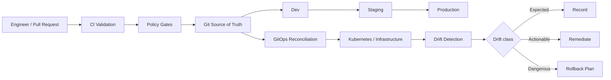

# Infrastructure GitOps Engineering

<p align="center"><strong>Controlled infrastructure delivery with GitOps, policy gates, drift detection and rollback planning</strong></p>

<p align="center">
<a href="https://github.com/obinna-obika-devops/infrastructure-gitops-engineering/actions/workflows/ci.yml"></a>


</p>

Infrastructure changes become risky when environments drift, approvals are inconsistent, production promotion is manual, or rollback is improvised after a failure. This repository models an infrastructure delivery system where Git is the source of truth and each change moves through validation, policy enforcement, controlled promotion, reconciliation, drift analysis and recovery planning.

The implementation combines Terraform, Kubernetes/Kustomize, GitOps patterns, OPA/Rego policy-as-code and Python automation to make infrastructure changes reviewable, repeatable and auditable.

## Engineering problem

A reliable infrastructure delivery process needs more than Terraform plans. It also needs clear environment boundaries, policy enforcement before deployment, visibility into configuration drift and a defined recovery path when a change goes wrong.

This project addresses those concerns by treating infrastructure change management as a software delivery workflow rather than a collection of manual operator steps.

## What was built

- Terraform-based infrastructure definitions with environment-aware configuration
- GitOps desired state using Kubernetes and Kustomize overlays
- Progressive promotion flow across dev, staging and production
- OPA/Rego policy gates evaluated before changes are accepted
- Python automation for promotion, drift analysis and rollback planning
- CI validation covering Terraform, manifests, policies and automation tests
- Representative drift and promotion scenarios for repeatable validation
- Operational documentation for change handling and drift response

## Key engineering decisions

- **Git remains authoritative.** Desired infrastructure and application state is versioned and reviewed before reconciliation.
- **Promotion is explicit.** Changes move through environments deliberately instead of being copied manually between them.
- **Policy is enforced before runtime.** Unsafe workload patterns are rejected during validation rather than discovered after deployment.
- **Drift is classified, not merely detected.** Differences are treated according to operational risk so teams can distinguish expected change from actionable or dangerous drift.
- **Rollback is planned ahead of failure.** Recovery logic identifies a last-known-good state instead of relying on ad hoc remediation.
- **Automation stays inspectable.** Promotion, drift and rollback logic lives in source-controlled Python and can be tested independently.

## Architecture



## Evidence at a glance

| Engineering area | Inspectable evidence |
|---|---|
| Terraform infrastructure | [`terraform/`](terraform/) |
| Desired state / overlays | [`gitops/`](gitops/) |
| Promotion, drift and rollback automation | [`automation/`](automation/) + [`scripts/`](scripts/) |
| Policy-as-code | [`policies/`](policies/) |
| Unit tests | [`tests/`](tests/) |
| Representative scenarios | [`examples/`](examples/) |
| CI validation | [`.github/workflows/ci.yml`](.github/workflows/ci.yml) |
| Operational documentation | [`docs/`](docs/) |

## Delivery workflow

1. An infrastructure change starts as a pull request.
2. CI checks Terraform formatting and validation.
3. Kubernetes overlays are rendered and verified.
4. OPA/Conftest policies evaluate the rendered workload.
5. Python automation tests verify promotion, drift and rollback behavior.
6. Approved desired state is promoted through environment boundaries.
7. A GitOps controller reconciles the declared state.
8. Scheduled drift analysis compares observed and desired state.
9. Drift is classified as expected, actionable or dangerous.
10. High-risk conditions trigger a rollback plan to a known-good revision.

## CI controls

The repository CI workflow performs concrete validation instead of only linting documentation. It includes:

- Terraform format, initialization and validation
- Kustomize rendering of the development overlay
- OPA policy enforcement with Conftest
- Python dependency installation and automated tests
- Sample drift-report validation
- Rollback-plan validation

See [`.github/workflows/ci.yml`](.github/workflows/ci.yml) for the complete pipeline.

## Repository layout

- `terraform/` — environment-aware infrastructure definitions
- `gitops/` — Kustomize overlays and GitOps application definitions
- `automation/` — promotion, drift and rollback logic
- `policies/` — OPA/Rego governance rules
- `scripts/` — operator-facing automation
- `tests/` — unit tests for change-management logic
- `docs/` — change management and drift-response procedures
- `examples/` — representative drift and promotion data

## Local validation

```bash
python -m venv .venv
source .venv/bin/activate
pip install -r requirements.txt
pytest -q
python scripts/promote.py --from dev --to staging --version 1.2.3
python scripts/drift_report.py examples/drift.json
python scripts/rollback_plan.py examples/promotion.json
```

```bash
terraform -chdir=terraform fmt -check -recursive
terraform -chdir=terraform init -backend=false
terraform -chdir=terraform validate
```

## Security and reliability principles

- No credentials are committed to Git.
- Production changes require explicit promotion gates.
- Kubernetes workloads use non-root execution and resource controls.
- Policies prevent unsafe infrastructure patterns before deployment.
- Drift is observable and actionable rather than silently ignored.
- Rollbacks are planned before high-risk changes are promoted.
- Automation is designed to be idempotent and auditable.

## Scope

This repository is a reference implementation of infrastructure change-management patterns. It demonstrates inspectable engineering workflows and validation logic, but it does not claim a currently running production environment unless an operator explicitly deploys and connects the required infrastructure and GitOps components.
