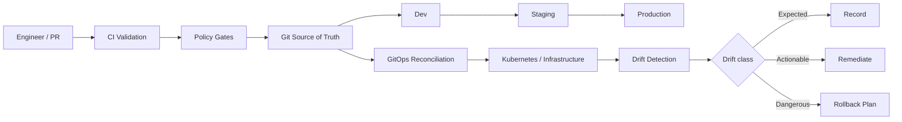

# Infrastructure GitOps Engineering

<p align="center">
<a href="https://github.com/obinna-obika-devops/infrastructure-gitops-engineering/actions/workflows/ci.yml"></a>


</p>

Production-grade reference platform for infrastructure change management using GitOps, Terraform, Kubernetes, policy-as-code, drift detection, progressive environment promotion, and automated rollback planning.

## Architecture



## Evidence at a glance

| Engineering area | Inspectable evidence |
|---|---|
| Terraform infrastructure | [`terraform/`](terraform/) |
| Desired state / overlays | [`gitops/`](gitops/) |
| Promotion, drift and rollback automation | [`automation/`](automation/) + [`scripts/`](scripts/) |
| Policy-as-code | [`policies/`](policies/) |
| Unit tests | [`tests/`](tests/) |
| Representative scenarios | [`examples/`](examples/) |
| CI validation | [`.github/workflows/ci.yml`](.github/workflows/ci.yml) |
| Operational documentation | [`docs/`](docs/) |

## What this demonstrates

- Git as the source of truth for infrastructure and application configuration
- Terraform environment promotion: dev → staging → production
- Argo CD-style continuous reconciliation
- Automated drift detection and classification
- Policy gates before infrastructure changes are promoted
- Change records and auditable promotion plans
- Rollback planning for failed releases or infrastructure changes
- Kubernetes Kustomize overlays and safe workload defaults
- CI validation for Terraform, Python automation, manifests, and policies

## Operating model

1. Infrastructure changes start as pull requests.
2. CI validates Terraform, Kubernetes manifests, tests and policies.
3. Promotion tooling verifies ordering and required approvals.
4. Git remains the desired-state source of truth.
5. A GitOps controller reconciles desired state with the cluster.
6. Scheduled drift detection compares observed and declared state.
7. Drift is classified as expected, actionable or dangerous.
8. Rollback plans identify the last known-good revision before remediation.

## Repository layout

- `terraform/` — environment-aware infrastructure definitions
- `gitops/` — Kustomize overlays and Argo CD application definitions
- `automation/` — promotion, drift and rollback logic
- `policies/` — OPA/Rego governance rules
- `scripts/` — operator-facing automation
- `tests/` — unit tests for change-management logic
- `docs/` — change management and drift-response procedures
- `examples/` — representative drift and promotion data

## Local validation

```bash
python -m venv .venv
source .venv/bin/activate
pip install -r requirements.txt
pytest -q
python scripts/promote.py --from dev --to staging --version 1.2.3
python scripts/drift_report.py examples/drift.json
python scripts/rollback_plan.py examples/promotion.json
```

```bash
terraform -chdir=terraform fmt -check -recursive
terraform -chdir=terraform init -backend=false
terraform -chdir=terraform validate
```

## Security and reliability principles

- No credentials are committed to Git.
- Production changes require explicit promotion gates.
- Kubernetes workloads use non-root execution and resource controls.
- Policies prevent unsafe infrastructure patterns before deployment.
- Drift is observable and actionable rather than silently ignored.
- Rollbacks are planned before high-risk changes are promoted.
- Automation is designed to be idempotent and auditable.

## Scope

This repository is a portfolio/reference implementation. Terraform and GitOps manifests demonstrate production engineering practices; no live cloud infrastructure or production deployment is claimed unless explicitly configured and deployed by an operator.
